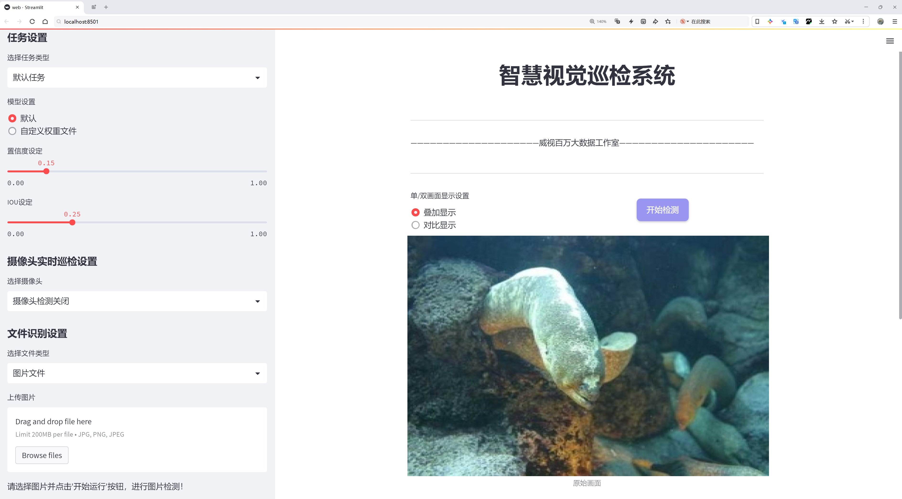
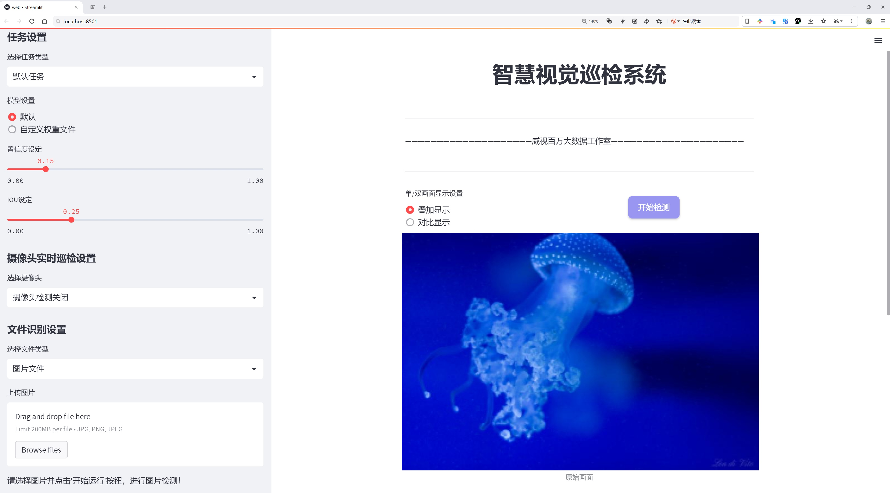
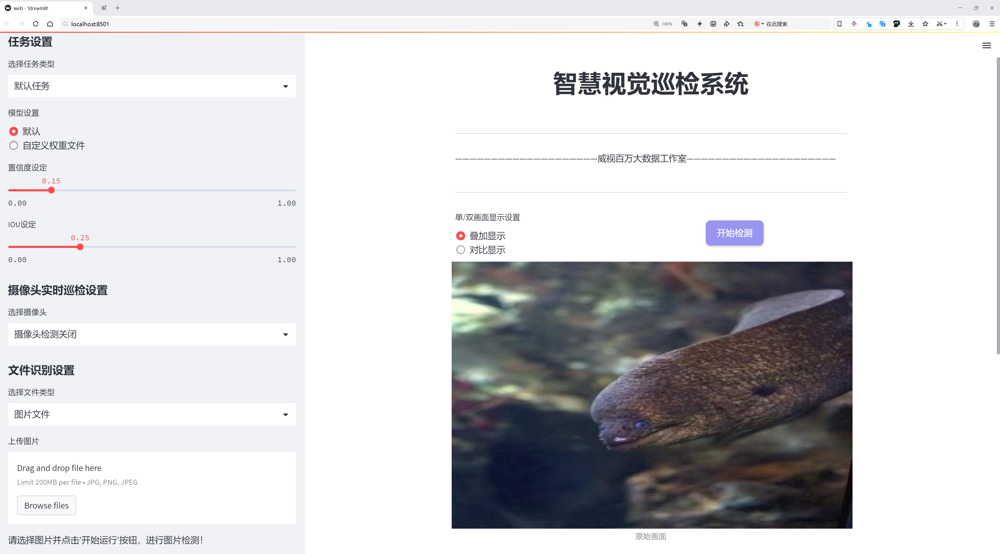
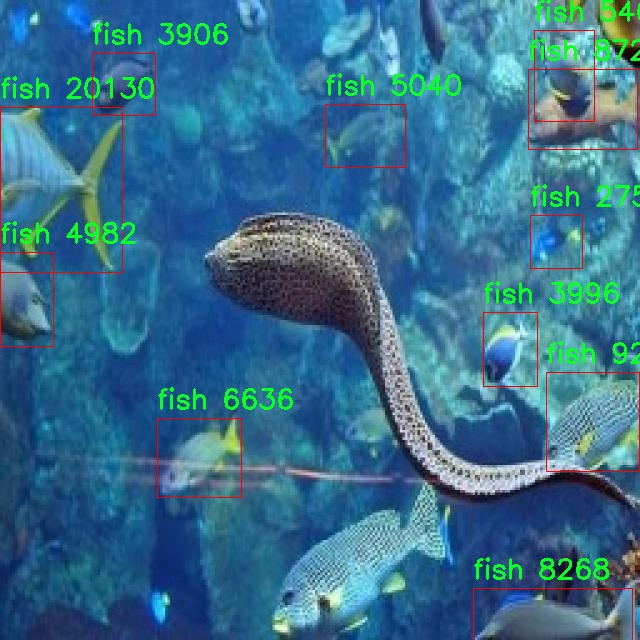
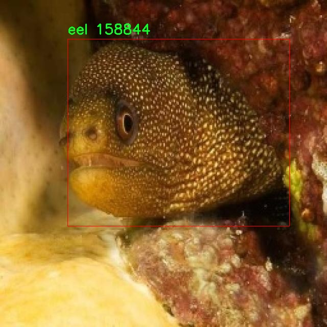

# 水下生物检测检测系统源码分享
 # [一条龙教学YOLOV8标注好的数据集一键训练_70+全套改进创新点发刊_Web前端展示]

### 1.研究背景与意义

项目参考[AAAI Association for the Advancement of Artificial Intelligence](https://gitee.com/qunmasj/projects)

项目来源[AACV Association for the Advancement of Computer Vision](https://kdocs.cn/l/cszuIiCKVNis)

研究背景与意义

随着全球海洋生态环境的日益恶化，水下生物的保护与监测变得愈发重要。水下生物不仅是海洋生态系统的重要组成部分，也是维持海洋生物多样性和生态平衡的关键。然而，传统的水下生物监测方法往往依赖于人工观察和记录，效率低下且容易受到人为因素的影响。因此，开发一种高效、准确的水下生物检测系统显得尤为迫切。

近年来，深度学习技术的迅猛发展为计算机视觉领域带来了革命性的变化，尤其是在目标检测方面。YOLO（You Only Look Once）系列模型因其实时性和高准确率而广泛应用于各类目标检测任务。YOLOv8作为该系列的最新版本，具备更强的特征提取能力和更快的推理速度，适合在复杂的水下环境中进行生物检测。因此，基于改进YOLOv8的水下生物检测系统的研究具有重要的理论价值和实际意义。

本研究所使用的数据集包含1700幅图像，涵盖了五类水下生物：鳗鱼、鱼类、人类、水母和龙虾。这些类别不仅具有代表性，而且在生态系统中扮演着不同的角色。例如，鱼类和鳗鱼是海洋食物链的重要组成部分，而水母的数量变化则直接影响到海洋生态的平衡。人类活动对水下生物的影响日益显著，监测人类与水下生物的互动也成为了生态研究的重要内容。通过对这些类别的检测与分析，可以为水下生物的保护和管理提供科学依据。

改进YOLOv8模型的关键在于如何提高其在水下环境中的适应性。水下图像通常存在光照不足、色彩失真和背景复杂等问题，这些因素都会影响目标检测的准确性。因此，本研究将针对这些挑战，采用数据增强、迁移学习等技术，提升模型在水下生物检测中的表现。同时，研究还将探讨如何优化模型的推理速度，以满足实时监测的需求。

此外，基于改进YOLOv8的水下生物检测系统的成功构建，不仅可以为海洋生态研究提供新的工具，还可以为海洋资源的可持续利用提供数据支持。通过对水下生物的实时监测，可以及时发现生态变化，帮助相关部门制定有效的保护措施，进而推动海洋生态环境的恢复与保护。

综上所述，基于改进YOLOv8的水下生物检测系统的研究，不仅具有重要的学术价值，还对实际的生态保护和资源管理具有深远的意义。通过这一研究，期望能够为水下生物的监测与保护提供一种高效、准确的解决方案，为全球海洋生态的可持续发展贡献力量。

### 2.图片演示







##### 注意：由于此博客编辑较早，上面“2.图片演示”和“3.视频演示”展示的系统图片或者视频可能为老版本，新版本在老版本的基础上升级如下：（实际效果以升级的新版本为准）

  （1）适配了YOLOV8的“目标检测”模型和“实例分割”模型，通过加载相应的权重（.pt）文件即可自适应加载模型。

  （2）支持“图片识别”、“视频识别”、“摄像头实时识别”三种识别模式。

  （3）支持“图片识别”、“视频识别”、“摄像头实时识别”三种识别结果保存导出，解决手动导出（容易卡顿出现爆内存）存在的问题，识别完自动保存结果并导出到tempDir中。

  （4）支持Web前端系统中的标题、背景图等自定义修改，后面提供修改教程。

  另外本项目提供训练的数据集和训练教程,暂不提供权重文件（best.pt）,需要您按照教程进行训练后实现图片演示和Web前端界面演示的效果。

### 3.视频演示

[3.1 视频演示](https://www.bilibili.com/video/BV1fPxjevEah/)

### 4.数据集信息展示

##### 4.1 本项目数据集详细数据（类别数＆类别名）

nc: 5
names: ['eel', 'fish', 'human', 'jellyfish', 'lobster']


##### 4.2 本项目数据集信息介绍

数据集信息展示

在水下生物检测领域，准确识别和分类各种生物是实现有效监测和保护水下生态系统的关键。为此，我们构建了一个名为“Underwater creatures detection”的数据集，旨在为改进YOLOv8模型提供丰富的训练数据，以提升其在水下环境中的检测性能。该数据集包含五个主要类别，分别是：鳗鱼（eel）、鱼类（fish）、人类（human）、水母（jellyfish）和龙虾（lobster）。这些类别的选择不仅考虑了水下生态系统的多样性，也反映了人类活动对水下生物的影响。

数据集的构建过程涉及多种数据采集技术，包括潜水拍摄、遥控水下机器人（ROV）和水下摄像头等。这些设备在不同的水域和环境条件下进行拍摄，确保数据的多样性和代表性。通过这种方式，我们获得了大量高质量的图像，涵盖了不同光照、深度和水质条件下的水下生物。这些图像不仅包括清晰的特写镜头，还包括在复杂背景下的生物，旨在提高模型在实际应用中的鲁棒性。

在数据标注方面，我们采用了专业的标注团队，确保每一张图像中的生物都被准确地标记。标注过程中，团队成员使用了先进的图像标注工具，确保每个类别的生物都能被清晰地识别和分类。为了进一步提高数据集的质量，我们还进行了多轮的审核和校正，确保标注的准确性和一致性。

“Underwater creatures detection”数据集的设计不仅关注数据的数量，更注重数据的质量和多样性。我们在数据集中引入了不同的拍摄角度、姿态和环境，以模拟真实世界中的各种情况。这种多样性使得模型在训练过程中能够学习到更为丰富的特征，从而在面对不同的水下生物时，能够做出更为准确的判断。

此外，为了增强模型的泛化能力，我们还对数据集进行了数据增强处理，包括随机裁剪、旋转、翻转和颜色变换等。这些技术的应用使得模型在训练过程中能够接触到更多样化的样本，从而提高其在未知数据上的表现。

在未来的研究中，我们计划进一步扩展数据集，增加更多的水下生物类别，并在不同的地理位置进行数据采集，以增强模型的适应性和准确性。同时，我们也将探索使用其他深度学习技术，结合“Underwater creatures detection”数据集，推动水下生物检测技术的发展。通过这些努力，我们希望能够为水下生态保护和资源管理提供更为有效的技术支持，促进人类与自然的和谐共生。







### 5.全套项目环境部署视频教程（零基础手把手教学）

[5.1 环境部署教程链接（零基础手把手教学）](https://www.ixigua.com/7404473917358506534?logTag=c807d0cbc21c0ef59de5)


[5.2 安装Python虚拟环境创建和依赖库安装视频教程链接（零基础手把手教学）](https://www.ixigua.com/7404474678003106304?logTag=1f1041108cd1f708b01a)

### 6.手把手YOLOV8训练视频教程（零基础小白有手就能学会）

[6.1 手把手YOLOV8训练视频教程（零基础小白有手就能学会）](https://www.ixigua.com/7404477157818401292?logTag=d31a2dfd1983c9668658)

### 7.70+种全套YOLOV8创新点代码加载调参视频教程（一键加载写好的改进模型的配置文件）

[7.1 70+种全套YOLOV8创新点代码加载调参视频教程（一键加载写好的改进模型的配置文件）](https://www.ixigua.com/7404478314661806627?logTag=29066f8288e3f4eea3a4)

### 8.70+种全套YOLOV8创新点原理讲解（非科班也可以轻松写刊发刊，V10版本正在科研待更新）

由于篇幅限制，每个创新点的具体原理讲解就不一一展开，具体见下列网址中的创新点对应子项目的技术原理博客网址【Blog】：


[8.1 70+种全套YOLOV8创新点原理讲解链接](https://gitee.com/qunmasj/good)

### 9.系统功能展示（检测对象为举例，实际内容以本项目数据集为准）

图9.1.系统支持检测结果表格显示

  图9.2.系统支持置信度和IOU阈值手动调节

  图9.3.系统支持自定义加载权重文件best.pt(需要你通过步骤5中训练获得)

  图9.4.系统支持摄像头实时识别

  图9.5.系统支持图片识别

  图9.6.系统支持视频识别

  图9.7.系统支持识别结果文件自动保存

  图9.8.系统支持Excel导出检测结果数据


### 10.原始YOLOV8算法原理

原始YOLOv8算法原理

YOLO（You Only Look Once）系列算法自其首次提出以来，便以其独特的设计理念和高效的目标检测能力而广受关注。YOLOv8作为该系列的最新版本，承载了前几代模型的优点，并在此基础上进行了诸多创新与改进，使其在实时目标检测任务中表现得更加出色。YOLOv8的设计不仅关注于检测精度的提升，还兼顾了模型的轻量化和计算效率，旨在满足嵌入式设备和移动平台的应用需求。

YOLOv8的核心理念是将目标检测问题转化为一个回归问题，通过一个单一的神经网络模型同时预测目标的位置和类别。这一设计思路使得YOLO系列在处理速度上具备了显著优势。YOLOv8在这一框架下进一步引入了Anchor-free目标检测方法，摆脱了传统目标检测中对锚框的依赖。传统方法通常需要预先定义锚框，这不仅增加了模型的复杂性，还在处理不同尺度和形状的目标时显得不够灵活。而YOLOv8通过直接预测目标的中心点和大小，简化了模型的结构，提高了检测的准确性和效率。

YOLOv8的网络结构主要由三部分组成：主干网络（backbone）、特征增强网络（neck）和检测头（head）。在主干网络部分，YOLOv8继续采用CSP（Cross Stage Partial）Net的设计理念，确保在特征提取过程中保持高效的梯度流动。YOLOv8引入了C2F模块替代了之前的C3模块，C2F模块通过并行化更多的梯度流分支，能够在保证轻量化的同时，获得更丰富的特征信息，从而提升了模型的精度和响应速度。

特征增强网络部分，YOLOv8采用了PAN-FPN（Path Aggregation Network with Feature Pyramid Network）的思想，进一步增强了不同尺度特征的融合能力。这种结构能够有效地整合来自主干网络的多层特征，提升模型对小目标和复杂场景的检测能力。通过对特征图的多层次处理，YOLOv8能够在不同尺度下捕捉到更为丰富的上下文信息，从而提高目标检测的鲁棒性。

在检测头部分，YOLOv8进行了显著的改进，采用了解耦头（Decoupled Head）结构，将目标分类和边界框回归任务分开处理。这一设计使得模型在处理复杂场景时能够更专注于各自的任务，减少了分类和定位之间的干扰，从而提升了整体的检测精度。解耦头的引入使得YOLOv8在分类和定位任务上都能够快速收敛，尤其是在多目标检测和重叠目标的情况下，表现得尤为突出。

此外，YOLOv8在损失函数的设计上也进行了优化，采用了DFL（Distribution Focal Loss）和CIoU（Complete Intersection over Union）损失函数，以提高模型对边界框的回归精度。这种损失函数设计旨在让模型更快地聚焦于目标的真实位置，减少了预测框与真实框之间的偏差，进而提升了检测的准确性。

在输入处理方面，YOLOv8采用了自适应图片缩放策略，能够根据输入图像的长宽比动态调整尺寸，最大限度地减少信息冗余，提高检测速度。为了增强模型的鲁棒性，YOLOv8在训练过程中引入了Mosaic数据增强技术，通过将多张图像拼接成一张新图像，迫使模型学习到更多的上下文信息，从而提高其在真实场景中的表现。

YOLOv8的轻量化设计使得其权重文件相较于前几代模型进一步减小，这使得它能够在各种嵌入式设备上高效运行，满足实时检测的需求。其在COCO数据集上的表现也证明了其优越性，YOLOv8在保持高精度的同时，显著提升了推理速度，成为目标检测领域的一项重要进展。

总的来说，YOLOv8通过一系列创新的设计和优化，提升了目标检测的效率和准确性，特别是在复杂场景和实时应用中表现得尤为突出。其Anchor-free的检测方式、解耦头结构以及高效的特征融合策略，使得YOLOv8在众多目标检测算法中脱颖而出，展现了其广泛的应用潜力和研究价值。随着YOLOv8的不断发展和完善，未来在智能监控、自动驾驶、机器人视觉等领域的应用前景将更加广阔。


### 11.项目核心源码讲解（再也不用担心看不懂代码逻辑）

#### 11.1 ui.py

以下是经过精简和注释的核心代码：

```python
import sys
import subprocess

def run_script(script_path):
    """
    使用当前 Python 环境运行指定的脚本。

    Args:
        script_path (str): 要运行的脚本路径
    """
    # 获取当前 Python 解释器的路径
    python_path = sys.executable

    # 构建运行命令，使用 streamlit 运行指定的脚本
    command = f'"{python_path}" -m streamlit run "{script_path}"'

    # 执行命令，并检查返回状态
    result = subprocess.run(command, shell=True)
    if result.returncode != 0:
        print("脚本运行出错。")

# 主程序入口
if __name__ == "__main__":
    # 指定要运行的脚本路径
    script_path = "web.py"  # 这里可以直接指定脚本名

    # 调用函数运行脚本
    run_script(script_path)
```

### 代码分析与注释：

1. **导入模块**：
   - `sys`：用于访问与 Python 解释器相关的变量和函数。
   - `subprocess`：用于创建新进程、连接到它们的输入/输出/错误管道，并获取返回码。

2. **定义 `run_script` 函数**：
   - 该函数接受一个参数 `script_path`，表示要运行的 Python 脚本的路径。
   - 使用 `sys.executable` 获取当前 Python 解释器的路径，以确保使用相同的环境来运行脚本。
   - 构建一个命令字符串，使用 `streamlit` 模块运行指定的脚本。
   - 使用 `subprocess.run` 执行构建的命令，并通过 `result.returncode` 检查命令的执行状态。如果返回码不为 0，表示脚本运行出错。

3. **主程序入口**：
   - 使用 `if __name__ == "__main__":` 确保该代码块仅在直接运行脚本时执行，而不是在被导入时执行。
   - 指定要运行的脚本路径为 `web.py`。
   - 调用 `run_script` 函数，传入脚本路径以执行该脚本。 

这样，代码的核心功能和逻辑得以保留，并且通过注释提供了清晰的解释。

这个程序文件 `ui.py` 的主要功能是运行一个指定的 Python 脚本，具体来说是通过 Streamlit 框架来启动一个 Web 应用。程序的实现过程可以分为几个关键部分。

首先，文件导入了一些必要的模块，包括 `sys`、`os` 和 `subprocess`。`sys` 模块用于访问与 Python 解释器相关的变量和函数，`os` 模块提供了与操作系统交互的功能，而 `subprocess` 模块则用于在 Python 中启动新进程、连接到它们的输入/输出/错误管道，并获取它们的返回码。

接下来，程序定义了一个名为 `run_script` 的函数，该函数接受一个参数 `script_path`，表示要运行的脚本的路径。在函数内部，首先获取当前 Python 解释器的路径，这通过 `sys.executable` 实现。然后，构建一个命令字符串，该命令使用当前的 Python 解释器来运行指定的脚本，具体命令格式为 `"{python_path}" -m streamlit run "{script_path}"`。

接着，使用 `subprocess.run` 方法执行构建好的命令。该方法的 `shell=True` 参数允许在 shell 中执行命令。执行后，程序检查返回的结果码，如果不为零，表示脚本运行出错，程序会输出相应的错误信息。

最后，在文件的主程序部分，使用 `if __name__ == "__main__":` 语句来确保当该文件作为主程序运行时，以下代码才会被执行。这里指定了要运行的脚本路径为 `web.py`，并调用 `run_script` 函数来启动这个脚本。

总的来说，这个程序文件的核心功能是通过 Streamlit 框架来运行一个 Web 应用，提供了一种简单的方式来启动和管理 Python 脚本的执行。

#### 11.2 70+种YOLOv8算法改进源码大全和调试加载训练教程（非必要）\ultralytics\engine\__init__.py

```python
# Ultralytics YOLO 🚀, AGPL-3.0 license

# 这段代码是Ultralytics YOLO模型的开源实现，遵循AGPL-3.0许可证。

# YOLO（You Only Look Once）是一种实时目标检测算法，能够在图像中快速识别和定位多个对象。

# Ultralytics是YOLO的一个实现版本，提供了高效的训练和推理功能，适用于各种计算机视觉任务。

# 下面是核心部分的伪代码示例，展示了YOLO模型的基本结构和工作流程。

class YOLO:
    def __init__(self, model_path):
        # 初始化YOLO模型，加载预训练权重
        self.model = self.load_model(model_path)

    def load_model(self, model_path):
        # 加载模型权重
        # 这里可以使用深度学习框架（如PyTorch）来加载模型
        pass

    def predict(self, image):
        # 对输入图像进行目标检测
        # 1. 预处理图像（如调整大小、归一化等）
        # 2. 将图像输入到模型中进行推理
        # 3. 获取模型输出的边界框、类别和置信度
        pass

    def post_process(self, outputs):
        # 对模型输出进行后处理
        # 1. 应用非极大值抑制（NMS）来去除重复的检测框
        # 2. 返回最终的检测结果
        pass

# 使用示例
if __name__ == "__main__":
    # 创建YOLO对象并加载模型
    yolo = YOLO("path/to/model_weights.pt")
    
    # 读取输入图像
    image = "path/to/image.jpg"
    
    # 进行目标检测
    outputs = yolo.predict(image)
    
    # 处理并显示检测结果
    results = yolo.post_process(outputs)
```

### 注释说明：
1. **类定义**：`YOLO`类是YOLO模型的核心，包含模型的初始化、加载、预测和后处理等功能。
2. **初始化方法**：`__init__`方法用于初始化YOLO模型并加载预训练的权重。
3. **加载模型**：`load_model`方法负责从指定路径加载模型权重，通常使用深度学习框架的加载功能。
4. **预测方法**：`predict`方法接收输入图像，进行预处理后将其输入模型进行推理，最终输出模型的检测结果。
5. **后处理方法**：`post_process`方法对模型的输出进行处理，包括去除重复的检测框，返回最终的检测结果。
6. **使用示例**：在主程序中创建YOLO对象，读取图像并进行目标检测，最后处理并显示结果。

这个程序文件的开头部分包含了一行注释，指明了该文件属于Ultralytics YOLO项目，并且遵循AGPL-3.0许可证。Ultralytics YOLO是一个广泛使用的目标检测算法，YOLO（You Only Look Once）系列在计算机视觉领域中非常流行，因其高效性和准确性而受到广泛关注。

文件的内容虽然只有一行注释，但这行注释的意义在于告知用户该项目的版权信息和使用条款。AGPL-3.0许可证是一种开源许可证，允许用户自由使用、修改和分发软件，但要求在分发时也必须提供源代码，并且对修改后的版本也适用相同的许可证。这种许可证的选择通常是为了促进开源社区的合作与共享。

总的来说，这个文件是Ultralytics YOLO项目的一部分，可能用于初始化该项目的某些功能或模块，尽管具体的实现和功能在这段代码中并未体现。

#### 11.3 70+种YOLOv8算法改进源码大全和调试加载训练教程（非必要）\ultralytics\trackers\basetrack.py

以下是代码中最核心的部分，并附上详细的中文注释：

```python
from collections import OrderedDict
import numpy as np

class TrackState:
    """跟踪状态的枚举类，表示对象跟踪的不同状态。"""
    New = 0      # 新跟踪
    Tracked = 1  # 正在跟踪
    Lost = 2     # 跟踪丢失
    Removed = 3  # 跟踪已移除

class BaseTrack:
    """对象跟踪的基类，处理基本的跟踪属性和操作。"""

    _count = 0  # 全局跟踪ID计数器

    track_id = 0  # 当前跟踪的ID
    is_activated = False  # 跟踪是否被激活
    state = TrackState.New  # 跟踪的初始状态

    history = OrderedDict()  # 存储跟踪历史的有序字典
    features = []  # 存储特征的列表
    curr_feature = None  # 当前特征
    score = 0  # 跟踪得分
    start_frame = 0  # 跟踪开始的帧数
    frame_id = 0  # 当前帧数
    time_since_update = 0  # 自上次更新以来的时间

    # 多摄像头支持
    location = (np.inf, np.inf)  # 跟踪对象的位置，初始化为无穷大

    @property
    def end_frame(self):
        """返回跟踪的最后帧ID。"""
        return self.frame_id

    @staticmethod
    def next_id():
        """递增并返回全局跟踪ID计数器。"""
        BaseTrack._count += 1
        return BaseTrack._count

    def activate(self, *args):
        """激活跟踪，使用提供的参数。"""
        raise NotImplementedError  # 该方法需要在子类中实现

    def predict(self):
        """预测跟踪的下一个状态。"""
        raise NotImplementedError  # 该方法需要在子类中实现

    def update(self, *args, **kwargs):
        """使用新的观测值更新跟踪。"""
        raise NotImplementedError  # 该方法需要在子类中实现

    def mark_lost(self):
        """将跟踪标记为丢失。"""
        self.state = TrackState.Lost

    def mark_removed(self):
        """将跟踪标记为已移除。"""
        self.state = TrackState.Removed

    @staticmethod
    def reset_id():
        """重置全局跟踪ID计数器。"""
        BaseTrack._count = 0
```

### 代码核心部分说明：
1. **TrackState 类**：定义了跟踪对象的不同状态，便于管理和更新跟踪状态。
2. **BaseTrack 类**：作为跟踪的基类，包含了跟踪对象的基本属性（如 ID、状态、历史记录等）和方法（如激活、预测、更新等）。
3. **静态方法**：`next_id` 和 `reset_id` 用于管理全局跟踪 ID 的生成和重置。
4. **状态管理**：提供了方法来标记跟踪对象的状态为丢失或已移除，便于后续处理。

这个程序文件是YOLO（You Only Look Once）系列算法中的一个基础跟踪器类的实现，主要用于对象跟踪。文件中定义了一个枚举类`TrackState`，用于表示对象跟踪的不同状态，包括新建（New）、被跟踪（Tracked）、丢失（Lost）和被移除（Removed）。这些状态有助于在跟踪过程中管理和更新对象的状态。

接下来，定义了一个名为`BaseTrack`的基类，它为对象跟踪提供了基本的属性和操作。该类包含了多个属性，例如跟踪ID（`track_id`）、激活状态（`is_activated`）、当前状态（`state`）、历史记录（`history`）、特征（`features`）、当前特征（`curr_feature`）、得分（`score`）、起始帧（`start_frame`）、当前帧ID（`frame_id`）、自上次更新以来的时间（`time_since_update`）以及位置（`location`）。这些属性用于存储和管理跟踪对象的相关信息。

类中还定义了一些方法。`end_frame`属性返回跟踪的最后一帧ID。`next_id`静态方法用于递增并返回全局跟踪ID计数器，确保每个跟踪对象都有唯一的标识符。`activate`、`predict`和`update`方法是用于激活跟踪、预测下一个状态和更新跟踪的占位符方法，这些方法需要在子类中实现具体的逻辑。`mark_lost`和`mark_removed`方法则用于将跟踪对象标记为丢失或移除，更新其状态。

最后，`reset_id`静态方法用于重置全局跟踪ID计数器，通常在需要重新开始跟踪时使用。

总的来说，这个文件为YOLOv8算法中的对象跟踪提供了一个基础框架，允许开发者在此基础上扩展和实现具体的跟踪算法。

#### 11.4 train.py

以下是经过简化和注释的核心代码部分，主要集中在YOLO检测模型的训练过程中：

```python
import random
import numpy as np
import torch.nn as nn
from ultralytics.data import build_dataloader, build_yolo_dataset
from ultralytics.engine.trainer import BaseTrainer
from ultralytics.models import yolo
from ultralytics.nn.tasks import DetectionModel
from ultralytics.utils import LOGGER, RANK
from ultralytics.utils.torch_utils import de_parallel, torch_distributed_zero_first

class DetectionTrainer(BaseTrainer):
    """
    基于检测模型的训练类，继承自BaseTrainer类。
    """

    def build_dataset(self, img_path, mode="train", batch=None):
        """
        构建YOLO数据集。

        参数:
            img_path (str): 包含图像的文件夹路径。
            mode (str): 模式，'train'或'val'，用户可以为每种模式自定义不同的数据增强。
            batch (int, optional): 批量大小，适用于'rect'模式。默认为None。
        """
        gs = max(int(de_parallel(self.model).stride.max() if self.model else 0), 32)
        return build_yolo_dataset(self.args, img_path, batch, self.data, mode=mode, rect=mode == "val", stride=gs)

    def get_dataloader(self, dataset_path, batch_size=16, rank=0, mode="train"):
        """构造并返回数据加载器。"""
        assert mode in ["train", "val"]
        with torch_distributed_zero_first(rank):  # 仅在DDP中初始化数据集 *.cache 一次
            dataset = self.build_dataset(dataset_path, mode, batch_size)
        shuffle = mode == "train"  # 训练模式下打乱数据
        workers = self.args.workers if mode == "train" else self.args.workers * 2
        return build_dataloader(dataset, batch_size, workers, shuffle, rank)  # 返回数据加载器

    def preprocess_batch(self, batch):
        """对图像批次进行预处理，包括缩放和转换为浮点数。"""
        batch["img"] = batch["img"].to(self.device, non_blocking=True).float() / 255  # 将图像转换为浮点数并归一化
        if self.args.multi_scale:  # 如果启用多尺度训练
            imgs = batch["img"]
            sz = (
                random.randrange(self.args.imgsz * 0.5, self.args.imgsz * 1.5 + self.stride)
                // self.stride
                * self.stride
            )  # 随机选择图像大小
            sf = sz / max(imgs.shape[2:])  # 计算缩放因子
            if sf != 1:
                ns = [
                    math.ceil(x * sf / self.stride) * self.stride for x in imgs.shape[2:]
                ]  # 计算新的形状
                imgs = nn.functional.interpolate(imgs, size=ns, mode="bilinear", align_corners=False)  # 调整图像大小
            batch["img"] = imgs
        return batch

    def get_model(self, cfg=None, weights=None, verbose=True):
        """返回YOLO检测模型。"""
        model = DetectionModel(cfg, nc=self.data["nc"], verbose=verbose and RANK == -1)  # 创建检测模型
        if weights:
            model.load(weights)  # 加载权重
        return model

    def plot_training_samples(self, batch, ni):
        """绘制带有注释的训练样本。"""
        plot_images(
            images=batch["img"],
            batch_idx=batch["batch_idx"],
            cls=batch["cls"].squeeze(-1),
            bboxes=batch["bboxes"],
            paths=batch["im_file"],
            fname=self.save_dir / f"train_batch{ni}.jpg",
            on_plot=self.on_plot,
        )

    def plot_metrics(self):
        """从CSV文件中绘制指标。"""
        plot_results(file=self.csv, on_plot=self.on_plot)  # 保存结果图
```

### 代码说明：
1. **DetectionTrainer类**：这是一个用于训练YOLO检测模型的类，继承自`BaseTrainer`。
2. **build_dataset方法**：构建YOLO数据集，支持训练和验证模式。
3. **get_dataloader方法**：创建数据加载器，支持多进程和数据打乱。
4. **preprocess_batch方法**：对输入的图像批次进行预处理，包括归一化和多尺度调整。
5. **get_model方法**：返回一个YOLO检测模型，并可选择加载预训练权重。
6. **plot_training_samples方法**：绘制训练样本及其注释，用于可视化训练过程。
7. **plot_metrics方法**：从CSV文件中绘制训练指标，用于评估模型性能。

这些核心部分构成了YOLO模型训练的基础逻辑，确保数据的准备、模型的构建和训练过程的可视化。

这个程序文件 `train.py` 是一个用于训练目标检测模型的脚本，特别是基于 YOLO（You Only Look Once）架构的模型。它继承自 `BaseTrainer` 类，提供了一系列方法来构建数据集、加载数据、预处理图像、设置模型属性、获取模型、验证模型、记录损失、绘制训练样本和指标等。

在文件的开头，导入了一些必要的库和模块，包括数学库、随机数生成库、深度学习框架 PyTorch 的神经网络模块，以及 Ultralytics 提供的相关功能模块。

`DetectionTrainer` 类中包含多个方法。`build_dataset` 方法用于构建 YOLO 数据集，接收图像路径、模式（训练或验证）和批次大小作为参数。它会根据模型的步幅（stride）来调整数据集的构建方式。

`get_dataloader` 方法用于构建并返回数据加载器，确保在分布式训练中只初始化一次数据集。它根据训练或验证模式设置是否打乱数据，并调整工作线程的数量。

`preprocess_batch` 方法负责对图像批次进行预处理，包括将图像缩放到适当的大小并转换为浮点数格式。它还支持多尺度训练，随机选择图像的大小进行训练。

`set_model_attributes` 方法用于设置模型的属性，包括类别数量和类别名称等。

`get_model` 方法返回一个 YOLO 检测模型，可以选择加载预训练权重。

`get_validator` 方法返回一个用于验证 YOLO 模型的验证器，记录损失名称。

`label_loss_items` 方法返回一个包含标记训练损失项的字典，适用于目标检测和分割任务。

`progress_string` 方法返回一个格式化的字符串，显示训练进度，包括当前的 epoch、GPU 内存使用情况、损失值、实例数量和图像大小。

`plot_training_samples` 方法用于绘制训练样本及其注释，帮助可视化训练过程。

最后，`plot_metrics` 和 `plot_training_labels` 方法分别用于绘制训练过程中的指标和创建带标签的训练图，便于分析模型的训练效果。

整体来看，这个脚本为 YOLO 模型的训练提供了一个完整的框架，涵盖了从数据准备到模型训练和验证的各个方面。

#### 11.5 70+种YOLOv8算法改进源码大全和调试加载训练教程（非必要）\ultralytics\data\converter.py

以下是经过简化和注释的核心代码部分，主要集中在 COCO 数据集的转换功能上：

```python
import json
from collections import defaultdict
from pathlib import Path
import numpy as np
from ultralytics.utils import TQDM, LOGGER
from ultralytics.utils.files import increment_path

def coco91_to_coco80_class():
    """
    将 COCO 数据集中的 91 类别 ID 转换为 80 类别 ID。
    返回一个列表，索引表示 80 类别 ID，值为对应的 91 类别 ID。
    """
    return [
        0, 1, 2, 3, 4, 5, 6, 7, 8, 9, 10, None, 11, 12, 13, 14, 15, 16, 17, 18, 19, 20, 21, 22, 23, None, 24, 25, None,
        None, 26, 27, 28, 29, 30, 31, 32, 33, 34, 35, 36, 37, 38, 39, None, 40, 41, 42, 43, 44, 45, 46, 47, 48, 49, 50,
        51, 52, 53, 54, 55, 56, 57, 58, 59, None, 60, None, None, 61, None, 62, 63, 64, 65, 66, 67, 68, 69, 70, 71, 72,
        None, 73, 74, 75, 76, 77, 78, 79, None]

def convert_coco(labels_dir='../coco/annotations/',
                 save_dir='coco_converted/',
                 use_segments=False,
                 use_keypoints=False,
                 cls91to80=True):
    """
    将 COCO 数据集的注释转换为 YOLO 格式的注释，适合用于训练 YOLO 模型。

    参数:
        labels_dir (str): COCO 数据集注释文件的目录路径。
        save_dir (str): 保存转换结果的目录路径。
        use_segments (bool): 是否在输出中包含分割掩码。
        use_keypoints (bool): 是否在输出中包含关键点注释。
        cls91to80 (bool): 是否将 91 个 COCO 类别 ID 映射到对应的 80 个 COCO 类别 ID。

    输出:
        在指定的输出目录生成转换后的文件。
    """
    # 创建保存目录
    save_dir = increment_path(save_dir)  # 如果目录已存在，则增加后缀
    for p in save_dir / 'labels', save_dir / 'images':
        p.mkdir(parents=True, exist_ok=True)  # 创建目录

    # 获取 COCO 80 类别 ID
    coco80 = coco91_to_coco80_class()

    # 导入 JSON 文件并进行转换
    for json_file in sorted(Path(labels_dir).resolve().glob('*.json')):
        fn = Path(save_dir) / 'labels' / json_file.stem.replace('instances_', '')  # 文件名处理
        fn.mkdir(parents=True, exist_ok=True)
        with open(json_file) as f:
            data = json.load(f)

        # 创建图像字典
        images = {f'{x["id"]:d}': x for x in data['images']}
        # 创建图像-注释字典
        imgToAnns = defaultdict(list)
        for ann in data['annotations']:
            imgToAnns[ann['image_id']].append(ann)

        # 写入标签文件
        for img_id, anns in TQDM(imgToAnns.items(), desc=f'Annotations {json_file}'):
            img = images[f'{img_id:d}']
            h, w, f = img['height'], img['width'], img['file_name']

            bboxes = []  # 存储边界框
            segments = []  # 存储分割
            keypoints = []  # 存储关键点
            for ann in anns:
                if ann['iscrowd']:
                    continue  # 跳过人群注释
                # COCO 边界框格式为 [左上角 x, 左上角 y, 宽度, 高度]
                box = np.array(ann['bbox'], dtype=np.float64)
                box[:2] += box[2:] / 2  # 将左上角坐标转换为中心坐标
                box[[0, 2]] /= w  # 归一化 x
                box[[1, 3]] /= h  # 归一化 y
                if box[2] <= 0 or box[3] <= 0:  # 如果宽度或高度小于等于 0
                    continue

                cls = coco80[ann['category_id'] - 1] if cls91to80 else ann['category_id'] - 1  # 类别
                box = [cls] + box.tolist()
                if box not in bboxes:
                    bboxes.append(box)  # 添加边界框
                if use_segments and ann.get('segmentation') is not None:
                    # 处理分割
                    # 省略具体的分割处理代码
                    pass
                if use_keypoints and ann.get('keypoints') is not None:
                    # 处理关键点
                    # 省略具体的关键点处理代码
                    pass

            # 写入文件
            with open((fn / f).with_suffix('.txt'), 'a') as file:
                for i in range(len(bboxes)):
                    # 写入边界框或分割
                    line = *(bboxes[i]),  # cls, box
                    file.write(('%g ' * len(line)).rstrip() % line + '\n')

    LOGGER.info(f'COCO 数据成功转换。\n结果保存到 {save_dir.resolve()}')
```

### 代码说明：
1. **coco91_to_coco80_class**: 该函数将 COCO 数据集中 91 个类别的 ID 转换为 80 个类别的 ID，返回一个列表。
2. **convert_coco**: 该函数负责将 COCO 数据集的注释转换为 YOLO 格式。它会创建保存目录，读取 JSON 文件，处理图像和注释，并将结果写入文件。
3. **注释部分**: 代码中添加了详细的中文注释，解释了每个部分的功能和作用。

这个程序文件主要用于将COCO数据集的标注格式转换为YOLO模型所需的标注格式。程序中包含了多个函数，每个函数负责不同的功能，以下是对代码的详细讲解。

首先，文件导入了一些必要的库，包括`json`、`defaultdict`、`Path`、`cv2`和`numpy`。这些库提供了处理文件、图像和数据的功能。

接下来，定义了两个函数`coco91_to_coco80_class`和`coco80_to_coco91_class`，它们分别用于将COCO数据集中91个类别的ID转换为80个类别的ID，反之亦然。这是因为YOLO模型通常使用80个类别的标注，而COCO数据集的原始标注包含91个类别。

`convert_coco`函数是主要的转换函数，它接受多个参数，包括标注文件的目录、保存结果的目录、是否使用分割和关键点信息，以及是否将91个类别ID映射到80个类别ID。该函数首先创建保存结果的目录，然后读取指定目录下的所有JSON标注文件。对于每个标注文件，程序会创建一个图像字典和图像-标注字典，并将每个图像的标注信息转换为YOLO格式。

在转换过程中，程序会将COCO格式的边界框转换为YOLO格式，并进行归一化处理。同时，如果需要，程序还会处理分割和关键点信息。最后，程序将转换后的标注信息写入指定的文本文件中。

`convert_dota_to_yolo_obb`函数用于将DOTA数据集的标注转换为YOLO的OBB（有向边界框）格式。该函数首先定义了类别名称与索引的映射关系，然后遍历训练和验证集中的图像，读取原始标注并将其转换为YOLO格式，最后保存到新的目录中。

此外，文件中还定义了`min_index`函数，用于找到两个二维点数组之间距离最短的点对的索引。`merge_multi_segment`函数则用于将多个分割线段合并为一个列表，通过连接每个分割的坐标来实现。

整体而言，这个程序文件提供了将COCO和DOTA数据集的标注格式转换为YOLO所需格式的功能，方便用户在训练YOLO模型时使用不同的数据集。通过这些转换，用户可以更轻松地准备数据，进行模型训练和评估。

#### 11.6 70+种YOLOv8算法改进源码大全和调试加载训练教程（非必要）\ultralytics\utils\__init__.py

以下是代码中最核心的部分，并附上详细的中文注释：

```python
import os
import platform
import logging.config
from pathlib import Path
import torch
import yaml

# 设置PyTorch多GPU DDP常量
RANK = int(os.getenv('RANK', -1))  # 获取当前进程的全局排名
LOCAL_RANK = int(os.getenv('LOCAL_RANK', -1))  # 获取当前进程的本地排名

# 定义其他常量
FILE = Path(__file__).resolve()  # 获取当前文件的绝对路径
ROOT = FILE.parents[1]  # 获取项目根目录
DEFAULT_CFG_PATH = ROOT / 'cfg/default.yaml'  # 默认配置文件路径

# 设置日志记录
def set_logging(name='ultralytics', verbose=True):
    """为给定名称设置日志记录。"""
    level = logging.INFO if verbose and RANK in {-1, 0} else logging.ERROR  # 根据verbosity和rank设置日志级别
    logging.config.dictConfig({
        'version': 1,
        'disable_existing_loggers': False,
        'formatters': {
            name: {
                'format': '%(message)s'}},
        'handlers': {
            name: {
                'class': 'logging.StreamHandler',
                'formatter': name,
                'level': level}},
        'loggers': {
            name: {
                'level': level,
                'handlers': [name],
                'propagate': False}}})

# 设置日志记录
set_logging()  # 初始化日志记录

# 加载默认配置
DEFAULT_CFG_DICT = yaml.safe_load(open(DEFAULT_CFG_PATH))  # 从默认配置文件加载配置字典
DEFAULT_CFG = SimpleNamespace(**DEFAULT_CFG_DICT)  # 将配置字典转换为简单命名空间

# 检查是否为Ubuntu系统
def is_ubuntu() -> bool:
    """检查操作系统是否为Ubuntu。"""
    try:
        with open('/etc/os-release') as f:
            return 'ID=ubuntu' in f.read()  # 检查os-release文件内容
    except FileNotFoundError:
        return False  # 文件不存在则返回False

# 检查是否在线
def is_online() -> bool:
    """检查互联网连接。"""
    import socket
    for host in '1.1.1.1', '8.8.8.8':  # 检查Cloudflare和Google的DNS
        try:
            socket.create_connection(address=(host, 53), timeout=2)  # 尝试连接
            return True  # 连接成功则返回True
        except (socket.timeout, socket.gaierror, OSError):
            continue  # 连接失败则继续尝试下一个
    return False  # 所有尝试失败则返回False

# 获取用户配置目录
def get_user_config_dir(sub_dir='Ultralytics'):
    """获取用户配置目录。"""
    if platform.system() == 'Windows':
        path = Path.home() / 'AppData' / 'Roaming' / sub_dir  # Windows用户配置路径
    elif platform.system() == 'Darwin':  # macOS
        path = Path.home() / 'Library' / 'Application Support' / sub_dir
    else:  # Linux
        path = Path.home() / '.config' / sub_dir

    path.mkdir(parents=True, exist_ok=True)  # 创建目录（如果不存在）
    return path

USER_CONFIG_DIR = get_user_config_dir()  # 获取用户配置目录
```

### 代码注释说明
1. **导入模块**：导入所需的标准库和第三方库。
2. **设置常量**：定义一些常量，如当前文件路径、项目根目录和默认配置文件路径。
3. **日志记录设置**：定义`set_logging`函数来配置日志记录，包括日志级别和格式。
4. **加载默认配置**：从默认配置文件中加载配置，并将其转换为简单命名空间以便于访问。
5. **系统检查**：定义`is_ubuntu`函数检查当前操作系统是否为Ubuntu。
6. **在线检查**：定义`is_online`函数检查是否有互联网连接。
7. **用户配置目录**：定义`get_user_config_dir`函数获取用户配置目录，并在必要时创建该目录。

以上部分是代码的核心逻辑，主要用于初始化环境和配置。

这个程序文件是Ultralytics YOLO（You Only Look Once）算法的一个工具模块，主要用于处理与YOLOv8相关的各种功能和设置。代码中包含了许多实用的功能，比如日志记录、配置管理、YAML文件的读写、线程安全的执行、环境检测等。

首先，文件导入了一系列的库，包括标准库和第三方库，如`cv2`、`torch`、`yaml`等。这些库为YOLOv8的实现提供了基础支持。接着，定义了一些常量和环境变量，比如多GPU训练的相关常量、默认配置文件路径、线程数等。

在设置部分，代码配置了PyTorch和NumPy的打印选项，并禁用了OpenCV的多线程，以避免与PyTorch的DataLoader发生冲突。接着，定义了一个自定义的`tqdm`类，用于显示进度条，增强了可读性。

文件中还定义了一些辅助类，如`SimpleClass`和`IterableSimpleNamespace`，它们提供了更友好的字符串表示和属性访问方法，便于调试和使用。

此外，文件实现了YAML文件的读写功能，提供了`yaml_save`和`yaml_load`函数，方便用户保存和加载配置数据。还有一个`yaml_print`函数用于美观地打印YAML内容。

代码中包含了一些用于环境检测的函数，如`is_ubuntu`、`is_colab`、`is_kaggle`等，用于判断当前运行环境，以便于做出相应的配置或调整。

在日志记录方面，代码设置了一个自定义的日志过滤器`EmojiFilter`，用于在Windows环境中移除日志消息中的表情符号，以确保兼容性。`set_logging`函数用于初始化日志记录的配置。

文件还定义了一些用于线程安全执行的工具，如`ThreadingLocked`类和`threaded`装饰器，确保在多线程环境中对共享资源的安全访问。

最后，代码中有一些与Git相关的功能，比如获取当前Git目录、获取Git远程URL和当前分支等。这些功能有助于在版本控制环境中使用YOLOv8。

总体而言，这个文件为YOLOv8提供了丰富的工具和功能，旨在简化用户的使用体验和开发过程。通过这些工具，用户可以更方便地配置、训练和评估YOLOv8模型。

### 12.系统整体结构（节选）

### 整体功能和构架概括

该项目是一个基于YOLOv8目标检测算法的实现，包含了训练、推理、数据处理和工具支持等多个模块。整体架构围绕着YOLOv8模型的训练和推理，提供了从数据准备、模型训练到结果评估和可视化的完整流程。项目中的各个文件和模块相互配合，形成了一个高效的目标检测系统。

- **数据处理**：包括数据集的转换和加载，以便将不同格式的数据集（如COCO和DOTA）转换为YOLO所需的格式。
- **模型训练**：提供了训练YOLOv8模型的功能，包括损失计算、模型更新和训练过程的可视化。
- **模型推理**：实现了对训练好的模型进行推理的功能，支持实时检测和分类。
- **工具和实用功能**：提供了日志记录、配置管理、环境检测、线程安全执行等辅助功能，简化了开发和使用过程。

### 文件功能整理表

| 文件路径                                                                                          | 功能描述                                                                                         |
|---------------------------------------------------------------------------------------------------|--------------------------------------------------------------------------------------------------|
| `ui.py`                                                                                           | 启动Streamlit Web应用，用于展示和交互YOLOv8模型的功能。                                         |
| `ultralytics/engine/__init__.py`                                                                 | 包含YOLOv8的基本设置和初始化功能。                                                              |
| `ultralytics/trackers/basetrack.py`                                                              | 定义了基础跟踪器类，用于对象跟踪的状态管理和更新。                                              |
| `train.py`                                                                                        | 实现YOLOv8模型的训练流程，包括数据加载、模型设置、训练过程监控等功能。                        |
| `ultralytics/data/converter.py`                                                                   | 提供数据集标注格式转换功能，将COCO和DOTA数据集的标注转换为YOLO格式。                          |
| `ultralytics/utils/__init__.py`                                                                  | 提供工具函数和类，包括日志记录、配置管理、YAML读写、环境检测等功能。                          |
| `ultralytics/models/yolo/detect/predict.py`                                                     | 实现YOLOv8模型的推理功能，处理输入图像并返回检测结果。                                        |
| `ultralytics/models/sam/amg.py`                                                                  | 可能与YOLOv8模型的特定功能或算法实现相关，具体功能需进一步分析。                               |
| `ultralytics/models/yolo/classify/__init__.py`                                                  | 初始化YOLOv8分类模型的相关功能。                                                                |
| `ultralytics/utils/torch_utils.py`                                                               | 提供与PyTorch相关的实用工具函数，如模型保存、加载等。                                          |
| `ultralytics/utils/autobatch.py`                                                                 | 实现自动批处理功能，优化数据加载和训练过程。                                                   |
| `ultralytics/models/utils/loss.py`                                                               | 定义YOLOv8模型的损失计算函数，用于训练过程中的损失评估。                                       |
| `ultralytics/utils/callbacks/comet.py`                                                          | 集成Comet.ml用于实验跟踪和可视化，记录训练过程中的指标和结果。                                 |

这个表格总结了每个文件的主要功能，帮助理解项目的整体结构和各个模块的作用。

注意：由于此博客编辑较早，上面“11.项目核心源码讲解（再也不用担心看不懂代码逻辑）”中部分代码可能会优化升级，仅供参考学习，完整“训练源码”、“Web前端界面”和“70+种创新点源码”以“13.完整训练+Web前端界面+70+种创新点源码、数据集获取”的内容为准。

### 13.完整训练+Web前端界面+70+种创新点源码、数据集获取


# [下载链接：https://mbd.pub/o/bread/ZpuZmppp](https://mbd.pub/o/bread/ZpuZmppp)